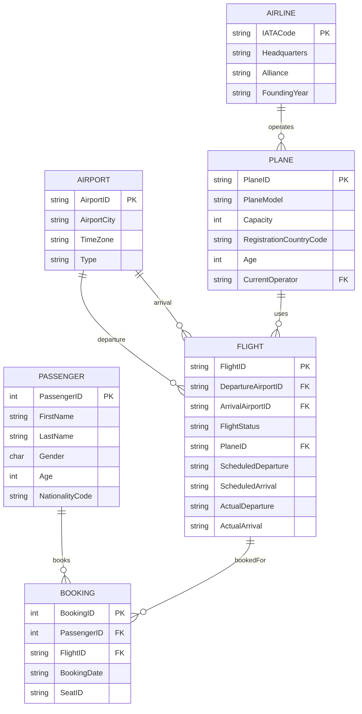
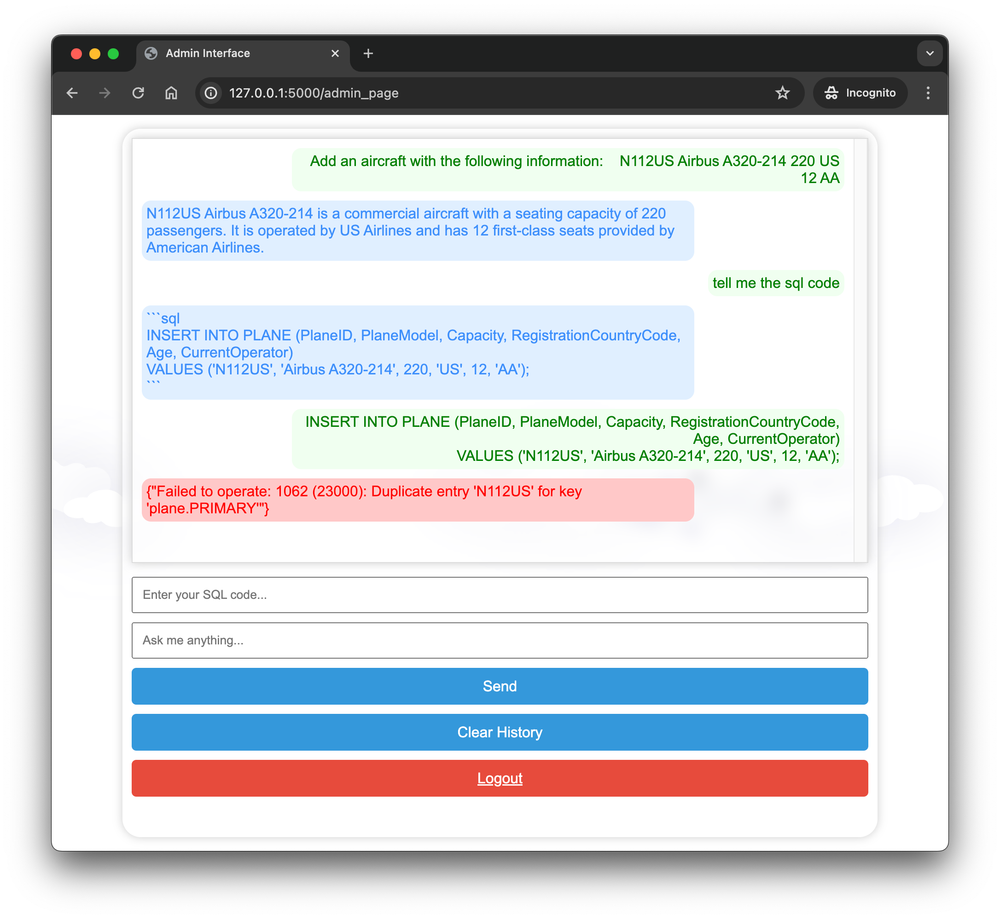

# Flight Information System


Our project is dedicated to advancing data management within the aviation sector through a sophisticated database system. Drawing on an Entity-Relationship (E-R) diagram, we design a relational database to optimize airline operational processes like passenger bookings and flight logistics. This system is expected to facilitate routine operations and analytical tasks via SQL, emphasizing efficiency and data integrity. We integrate the Large Language Models (LLM) into our project to refine the database's architecture, enhancing query generation. We anticipate demonstrating the system's capability to improve the handling of aircraft data and the interaction of diverse operational entities. The project's outcome will be a functional database with a user-friendly web interface, complete with realistic data and queries that replicate the dynamics of airline management.

## Group Members

- Yuzhe Yang: <121090684@link.cuhk.edu.cn>
- Zitong Wang: <121090530@link.cuhk.edu.cn>
- Baoyin Zhang: <121090761@link.cuhk.edu.cn>
- Haoqi Zhang: <121090766@link.cuhk.edu.cn>
- Jianzhen Chen: <121090036@link.cuhk.edu.cn>
- Zhidong Peng: <121090448@link.cuhk.edu.cn>

## Dataset

From United States Department of Transportation: <https://www.transtats.bts.gov/DataIndex.asp>

From Kaggle: <https://www.kaggle.com/datasets/iamsouravbanerjee/airline-dataset>

## ER diagram



## How to run this project

```bash
# clone the repo
git clone https://github.com/tobyyang7/flight-information-system.git

# install dependencies
pip install -r requirements.txt

# setup the database
bash setup.sh

# run the app
python app.py

```

Then open your browser and visit <http://127.0.0.1:5000/>

There are two types of ways to interact with the database:

|        | ID | Password | Interaction|
| ------ | --- | ----------- |----------------|
| Admin  | admin   | admin1234     |add, delete, update, and query the data|
| User   | user   | user1234     |only query the data|

If you cannot find the interface, please check whether the database is running.

## LLM interface

**Notice:** You need to configure your own API keys and base URL. If you need assistance, please contact [@TobyYang7](https://github.com/tobyyang7).

In the user interface, you can interact with the LLM through a chatbox to inquire about flights and airports information.

In the admin interface, you can use the LLM to help you complete SQL code, which can then be executed directly.


