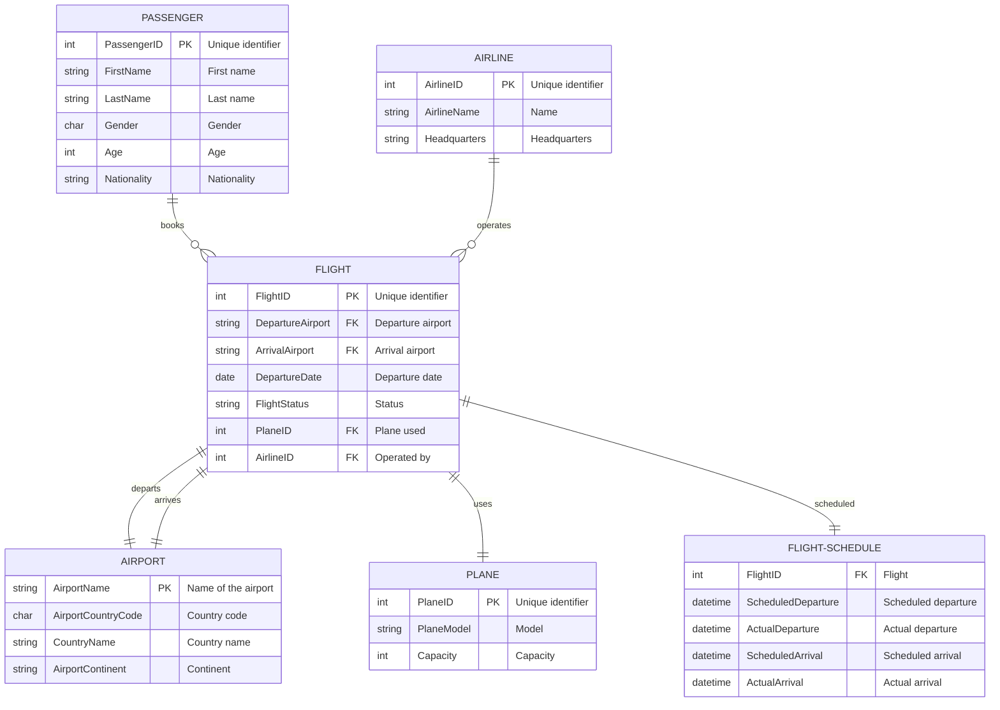

# Flight Information System

## Group Members

Yuzhe Yang: <121090684@link.cuhk.edu.cn>
Zitong Wang: <121090530@link.cuhk.edu.cn>
Baoyin Zhang: <121090761@link.cuhk.edu.cn>
Haoqi Zhang: <121090766@link.cuhk.edu.cn>
Jianzhen Chen: <121090036@link.cuhk.edu.cn>
Zhidong Peng: <121090448@link.cuhk.edu.cn>

## Dataset

From United States Department of Transportation: <https://www.transtats.bts.gov/DataIndex.asp>
From Kaggle: <https://www.kaggle.com/datasets/iamsouravbanerjee/airline-dataset>

## Some useful links

<https://github.com/fuzhengwei/CodeGuide/blob/50a1d68e4038d8f0eee966e49d65d74926676ad4/docs/md/road-map/mysql.md?plain=1#L119>
<https://github.com/dongmingli-Ben/CSC3170-Database-NBA>

## Environment

linux x86_64

## ER diagram

## How to run this project
